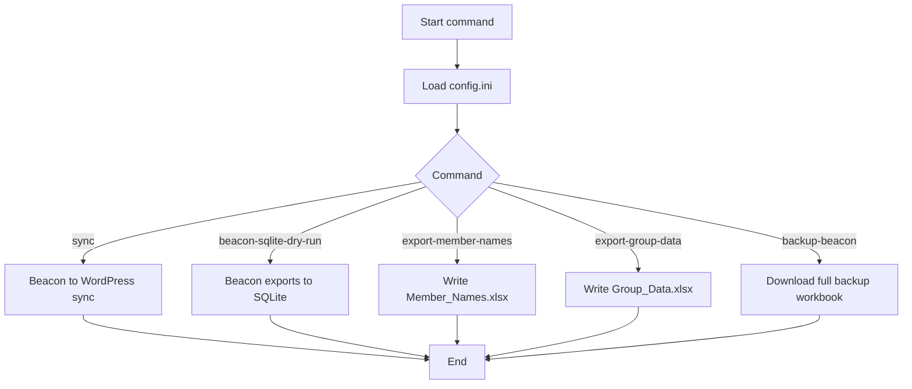
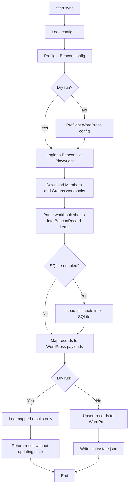
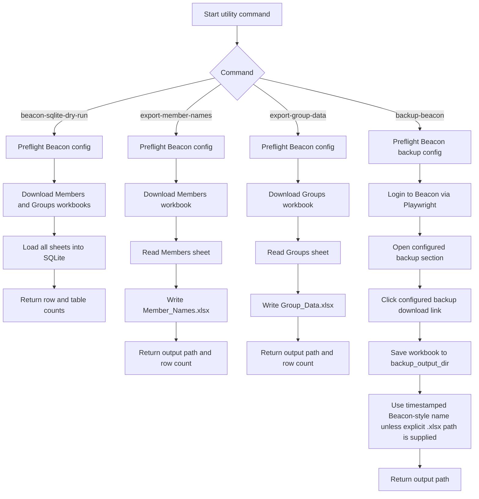

# Appendix 4: Application Process Flow

{style="float: right; max-width: 180px; height: auto; margin: -4.5rem 0 0.5rem 1rem;"}

This appendix summarises the current runtime command flows implemented by BeaconUtilities.
Diagram labels are intentionally concise and rendered at a larger base font for readability.

## Diagram 1: Command Overview

## Diagram 2: Sync Flow

## Diagram 3: Utility Export Flows

## Notes

- The `sync` command is the only path that publishes to WordPress.
- The `beacon-sqlite-dry-run`, `export-member-names`, `export-group-data`, and `backup-beacon` commands do not update WordPress.
- The `backup-beacon` command does not stage data to SQLite or update `state/state.json`.
- The `export-group-data` command writes only the Groups sheet rows to `Group_Data.xlsx`.
- Default backup naming follows the Beacon-style pattern `YYYYMMDDHHMM_<site_name> u3abackup.xlsx`.
