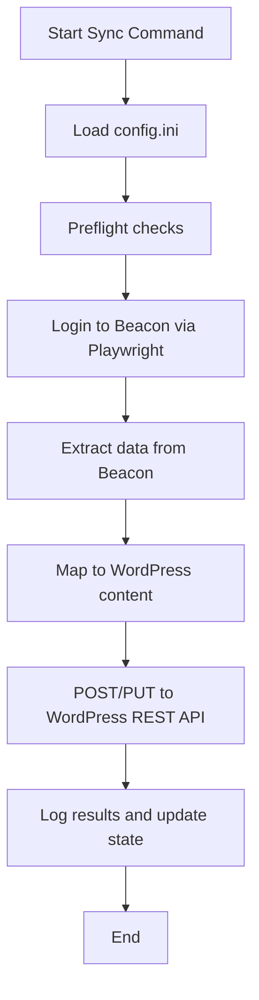

# Appendix 4: Application Process Flow

{style="float: right; max-width: 180px; height: auto; margin: -4.5rem 0 0.5rem 1rem;"}

Process flow diagrams will be added here as the application workflows are defined.

## Diagram 1: Overview (placeholder)

